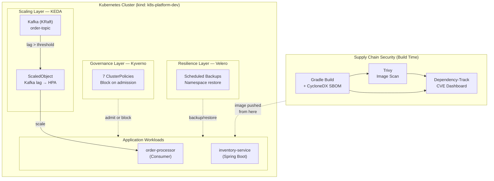

# Kubernetes Platform Toolkit

A hands-on portfolio of platform engineering practices built on a local Kubernetes
cluster (kind). Each project tackles a different operational concern that any
production platform team deals with, scaling, governance, security, and resilience.

Everything here was built and tested locally. No cloud account needed.

---

## Platform Architecture



---

## Projects

| Project | Problem it solves | Key Tools |
|---|---|---|
| [KEDA Event-Driven Autoscaling](keda-event-driven-autoscaling/) | Workloads sit idle consuming resources when there's no work. Scale to zero when idle, scale out fast when load arrives. | KEDA 2.15.1, Kafka, HPA |
| [Kyverno Policy Engine](kyverno-policy-engine/) | Developers deploy containers running as root, with no resource limits, using `latest` tags. Catch and block misconfigurations at admission time. | Kyverno v1.18.1, 7 ClusterPolicies |
| [Supply Chain Security](supply-chain-security/) | You can't secure what you can't see. Know every library inside every image you ship, and get alerted when a new CVE hits your dependencies. | CycloneDX, Trivy, Dependency-Track |
| [Velero Backup & Restore](velero/) | Clusters fail. Namespaces get deleted. Have a tested restore path before you need it. | Velero, MinIO |

---

## How They Work Together

These aren't four separate tools — they enforce different aspects of the same platform contract:

**Before deployment (supply chain):**
Gradle builds the app → CycloneDX generates an SBOM → Trivy scans the image →
Dependency-Track tracks CVEs. A Critical CVE fails the build before the image
reaches the cluster.

**At admission (governance):**
When the image is deployed, Kyverno intercepts the request. It blocks the pod if
the image uses `:latest`, runs as root, has no resource limits, or enables
privileged mode. The developer gets an immediate error with the reason.

**At runtime (scaling):**
KEDA watches Kafka consumer group lag on `order-topic`. When lag crosses the
threshold, it scales `order-processor` from 0 to N replicas. When lag clears,
it scales back to zero. No manual intervention.

**At failure (resilience):**
Velero takes scheduled backups of namespaces and persistent volumes. If a
namespace is accidentally deleted or a node fails, the workload is restored
from the last backup in minutes.

---

## Tech Stack

| Layer | Technology |
|---|---|
| Cluster | kind (Kubernetes in Docker) |
| Package management | Helm 3 |
| Autoscaling | KEDA 2.15.1 |
| Policy engine | Kyverno v1.18.1 |
| Message broker | Apache Kafka 3.9.0 (KRaft) |
| SBOM generation | CycloneDX Gradle plugin 1.8.2 |
| Vulnerability scanning | Trivy 0.70.0 |
| CVE tracking | Dependency-Track 4.14.2 |
| Backup & restore | Velero |
| App runtime | Java 17, Spring Boot 3.2.5 |

---

## Running Locally

**Prerequisites:** Docker Desktop (or Rancher Desktop), kind, kubectl, Helm 3

```bash
# Create the cluster
kind create cluster --name k8s-platform-dev

# Each project has its own setup — see the README in each folder
```

See individual project READMEs for step-by-step setup and testing.
