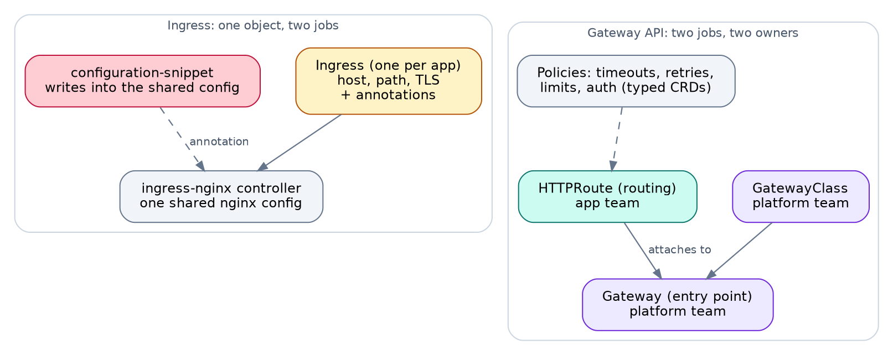
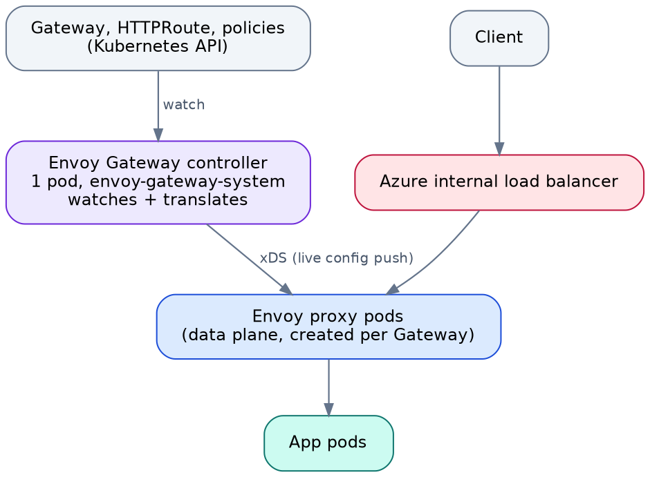
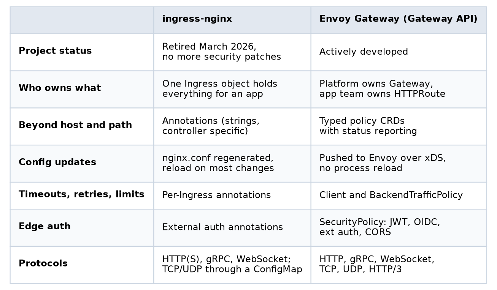
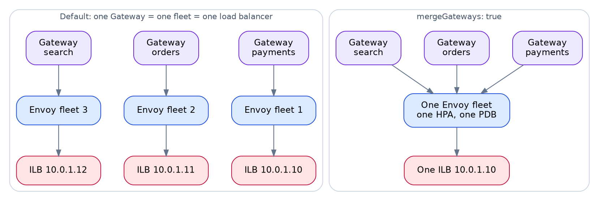
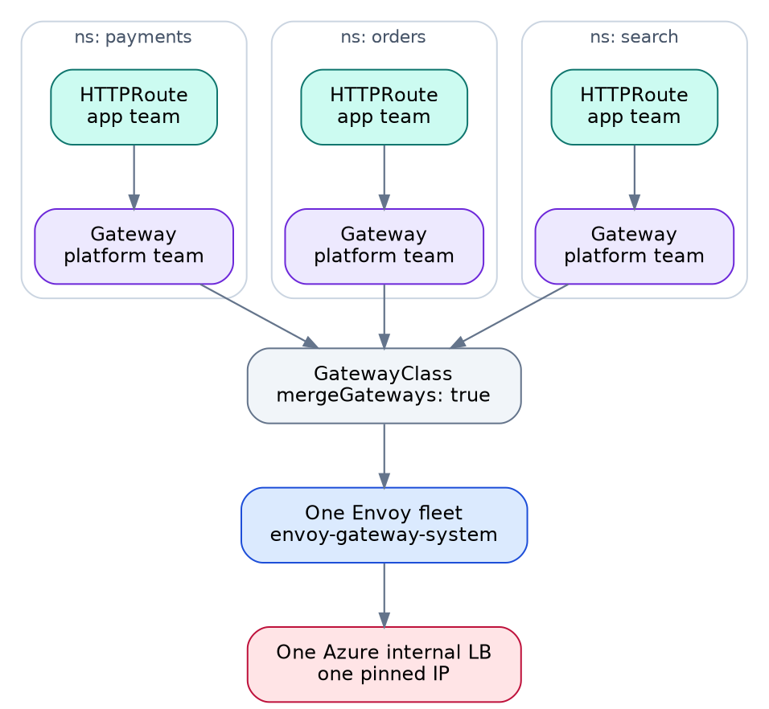
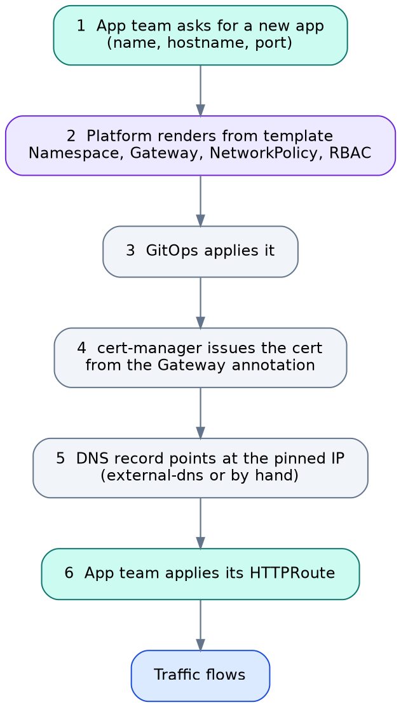
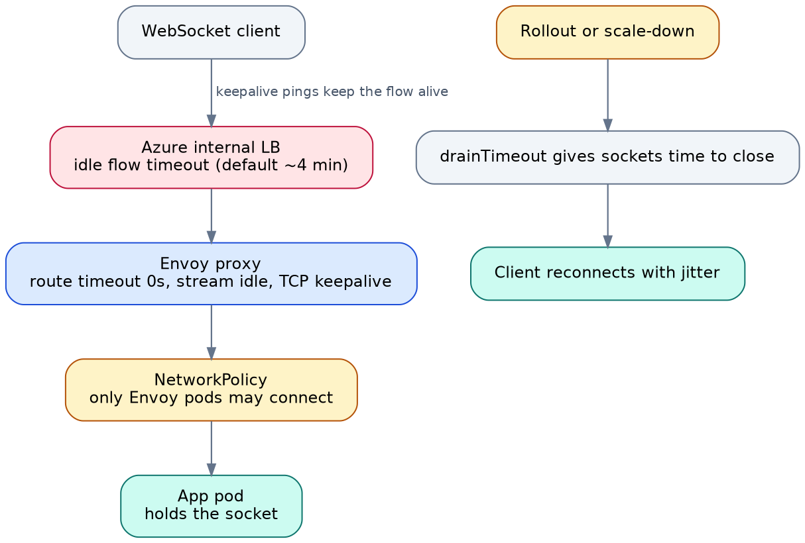
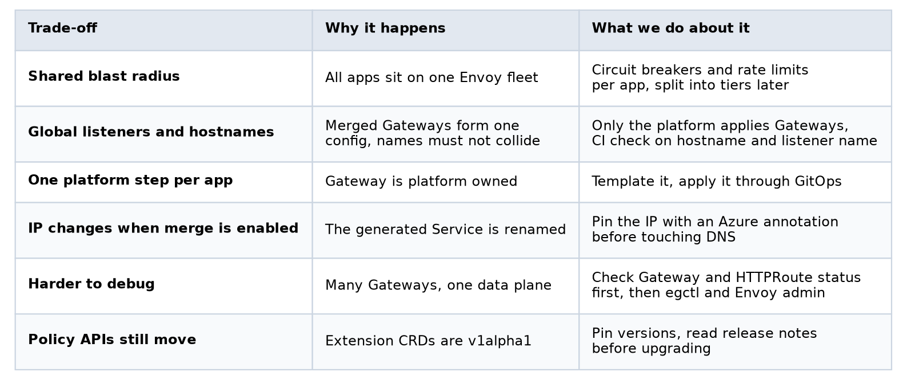

# Replacing ingress-nginx with Envoy Gateway on a multi-tenant AKS cluster

*A Gateway per app, merged into one Envoy fleet, with the platform team owning the entry point and app teams owning their routes. Design, implementation, a real-time scenario and the trade-offs.*

---

## TL;DR

- **Why we moved:** ingress-nginx was retired in March 2026, and Ingress mixes two jobs (owning the entry point and owning the routing) into one object. That fits badly on a cluster where every app is isolated.
- **What we chose:** Gateway API with Envoy Gateway. The platform team owns the `Gateway`. App teams own only their `HTTPRoute`.
- **How it runs:** one Gateway per app, with `mergeGateways: true`, so all of them share one Envoy fleet behind one Azure internal load balancer. Certificates come from cert-manager, one per hostname, because wildcards are not allowed.
- **What it costs:** a shared blast radius, one global namespace for listener names and hostnames, and one platform step per new app.
- **For real-time apps:** timeouts, keepalives and draining decide whether WebSockets survive. The defaults will cut them.

Everything here comes with manifests you can copy: the full YAML is in the `manifests/` folder next to this article.

---

## 1. The setup

We run a multi-tenant AKS cluster. Each app gets its own namespace, its own RBAC and its own network policies. Traffic comes in through an Azure internal load balancer only. The PKI team does not allow wildcard certificates, so every hostname needs its own certificate, and cert-manager is already running in the cluster.

Two teams touch the edge:

- The **platform team** runs the cluster and everything shared.
- **App teams** deploy their own services and decide how traffic reaches them.

That split is the whole story of this article. The question was never only "which controller". It was "who is allowed to change what".

---

## 2. Why we moved off ingress-nginx

The trigger was simple. Kubernetes SIG Network and the Security Response Committee announced that ingress-nginx would be retired in March 2026, with no more releases, bug fixes or security patches after that. Existing installs keep running, which is part of the risk: nothing breaks until something does. The Kubernetes Steering Committee said plainly that staying on it leaves you exposed.

But retirement only forced the date. The design problem was already there.

An `Ingress` is one object doing two jobs. It says where traffic enters (host, TLS) and how it is routed (paths, backends). Anything beyond that went into annotations. Annotations are strings, specific to one controller, and checked only when the controller loads them. Some, like `configuration-snippet`, write straight into the shared controller's nginx config unless a cluster admin has disabled them.

In a cluster where each app is isolated by namespace, RBAC and network policy, that is a gap. The isolation held at the namespace edge, but the edge itself was one shared piece of configuration that every team could influence through its own Ingress.


*Figure 1. Ingress puts everything in one object. Gateway API gives the platform and the app team separate objects.*

---

## 3. How Envoy Gateway works

Gateway API splits the Ingress into roles:

- **GatewayClass** says which controller handles Gateways of this kind. Platform team.
- **Gateway** is the entry point: listeners, ports, hostnames, TLS. Platform team.
- **HTTPRoute** is the routing: paths, headers, backends. App team.

Envoy Gateway is an implementation of that API built on Envoy proxy. It has two parts.

The **control plane** is one controller pod in `envoy-gateway-system`. It watches Gateway API resources, translates them into Envoy configuration and pushes that configuration to the proxies over xDS.

The **data plane** is the Envoy proxy pods that carry the traffic. Envoy Gateway creates them for you.


*Figure 2. The controller never sits in the traffic path. It only pushes configuration.*

Because configuration goes over xDS, a route change reaches the running proxies without a process reload. And if the controller goes down, the Envoy pods keep serving the last configuration they received. You lose the ability to change things, not the traffic.

### What each object actually creates

This is the part that shaped our design, so it is worth being exact:

- **Helm install:** one controller Deployment (`envoy-gateway`) in `envoy-gateway-system`, plus CRDs and RBAC.
- **GatewayClass and EnvoyProxy:** nothing runs. They are settings.
- **Gateway:** an Envoy Deployment and a Service of type `LoadBalancer`. On AKS that means a new Azure load balancer with its own IP.
- **HTTPRoute and policies:** nothing runs. They are configuration pushed into an existing fleet.

One Gateway means one Envoy fleet and one load balancer. Hold on to that.

### What you get beyond routing

Envoy Gateway adds typed policy resources that attach to Gateways and routes, so the settings that used to live in annotations have a schema and a status:

- **ClientTrafficPolicy** controls the client side: idle and request timeouts, TCP keepalive, HTTP/2 and HTTP/3 settings, connection limits, client TLS and mTLS.
- **BackendTrafficPolicy** controls the backend side: load balancing (least request by default, consistent hash for stickiness), retries, circuit breakers, active and passive health checks, rate limits and timeouts.
- **SecurityPolicy** handles edge authentication and authorization: JWT, OIDC, external auth and CORS.

On top of that, plain Gateway API gives weighted traffic splitting, header and path matching, redirects and rewrites.


*Figure 3. The two side by side.*

---

## 4. The use case

Written down, our requirements were:

1. **Keep tenant isolation.** App teams must not be able to change the shared entry point.
2. **Let app teams own their routing.** Paths, headers, rollouts, without a ticket.
3. **Internal only.** One Azure internal load balancer, as few IPs as possible.
4. **A certificate per hostname,** issued automatically, with no wildcards.
5. **Support real-time apps,** meaning long-lived WebSocket and streaming connections, not only short request and response calls.

---

## 5. Design options

I looked at three designs. They all work. They differ in who owns what and what they cost at runtime.

### Option A: a Gateway per app, not merged

This is what the tutorials show. Every app gets a Gateway, and every Gateway gets its own Envoy fleet and its own Azure load balancer. Isolation is excellent. The cost grows linearly: ten apps means ten fleets, ten IPs, ten DNS records and a minimum of ten times your replica floor.

### Option B: one shared Gateway owned by the platform team

One Gateway carries a listener for every hostname. It is cheap at runtime, but two things hurt.

First, every onboarding means editing one shared Gateway, so the platform team sits in every request and the file grows with every app.

Second, certificates. cert-manager creates the `Certificate` as a child of the Gateway, and owner references cannot cross namespaces. So the certificate Secret has to live in the Gateway's namespace. With one platform-owned Gateway, every team's certificate ends up in the platform's namespace, and with no wildcards allowed, the platform team owns every renewal.

### Option C: a Gateway per app, with `mergeGateways: true`

This is the one we chose. Each app still has its own Gateway object in its own namespace. But with `mergeGateways: true` on the `EnvoyProxy` attached to the GatewayClass, Envoy Gateway collapses all of them into one Envoy fleet and one load balancer.


*Figure 4. Same Gateways, very different runtime. Left: one fleet and one load balancer per app. Right: one of each.*

Why this fit us:

- Each Gateway and its certificate live in the app's own namespace, which matches the isolation model.
- The platform team still owns the Gateway, because RBAC says so (more on that below).
- The runtime cost is that of a single shared gateway.


*Figure 5. The final design. Teal is app team, purple is platform team.*

---

## 6. Implementation

The complete manifests are in the `manifests/` folder. Here are the parts that matter.

> **A note on versions.** The Envoy Gateway policy CRDs are still `v1alpha1`, and field names move between releases. Check any field against your installed version with `kubectl explain`, for example `kubectl explain backendtrafficpolicy.spec.timeout.http`.

### 6.1 Platform, once: EnvoyProxy and GatewayClass

```yaml
apiVersion: gateway.envoyproxy.io/v1alpha1
kind: EnvoyProxy
metadata:
  name: internal-proxy
  namespace: envoy-gateway-system
spec:
  mergeGateways: true
  provider:
    type: Kubernetes
    kubernetes:
      envoyService:
        type: LoadBalancer
        externalTrafficPolicy: Cluster
        annotations:
          service.beta.kubernetes.io/azure-load-balancer-internal: "true"
          service.beta.kubernetes.io/azure-load-balancer-internal-subnet: "aks-ingress-subnet"
          service.beta.kubernetes.io/azure-load-balancer-ipv4: "10.0.1.10"
      envoyHpa:
        minReplicas: 3
        maxReplicas: 30
      envoyPDB:
        minAvailable: 2
  shutdown:
    drainTimeout: 60s
---
apiVersion: gateway.networking.k8s.io/v1
kind: GatewayClass
metadata:
  name: internal
spec:
  controllerName: gateway.envoyproxy.io/gatewayclass-controller
  parametersRef:
    group: gateway.envoyproxy.io
    kind: EnvoyProxy
    name: internal-proxy
    namespace: envoy-gateway-system
```

**Pin the IP.** When we turned merging on, the generated Service was renamed, Azure released the old frontend IP and handed us a new one, and the DNS record had to be rewritten by hand. The `azure-load-balancer-ipv4` annotation fixes the address for good. It has to sit inside the subnet named in the annotation above it, and Azure reserves the first four addresses of every subnet, so `.10` is a safe pick.

Also notice that there is no CPU limit on the Envoy container in the full manifest. Envoy is CPU bound, and throttling shows up as latency, not as a signal that makes the autoscaler react.

### 6.2 Platform, per app: the Gateway

```yaml
apiVersion: gateway.networking.k8s.io/v1
kind: Gateway
metadata:
  name: orders
  namespace: orders
  annotations:
    cert-manager.io/cluster-issuer: corp-internal-ca
spec:
  gatewayClassName: internal
  listeners:
    - name: orders-https
      protocol: HTTPS
      port: 443
      hostname: orders.int.corp
      tls:
        mode: Terminate
        certificateRefs:
          - {kind: Secret, name: orders-int-corp-tls}
      allowedRoutes:
        namespaces: {from: Same}
        kinds: [{kind: HTTPRoute}]
```

Three details carry weight here:

- **`allowedRoutes: from: Same`** means only routes in the `orders` namespace can attach. Another team cannot hang a route off this Gateway.
- **The hostname is fixed** in the listener, so an app team cannot claim a different one.
- **The cert-manager annotation** is all it takes to get a certificate. cert-manager's Gateway support reads each listener, builds a `Certificate` from its hostname, and fills the Secret named in `certificateRefs`. A listener without a hostname is skipped. The Gateway API support in cert-manager also has to be switched on (the `--enable-gateway-api` flag on older versions, so check your install).

Because Gateways are merged, listener names and hostnames must be unique across the whole cluster. We prefix the listener name with the namespace, and a collision would invalidate the merged configuration for every app.

### 6.3 App team: the HTTPRoute

```yaml
apiVersion: gateway.networking.k8s.io/v1
kind: HTTPRoute
metadata:
  name: orders
  namespace: orders
spec:
  parentRefs:
    - {name: orders, sectionName: orders-https}
  hostnames: ["orders.int.corp"]
  rules:
    - matches:
        - path: {type: PathPrefix, value: /}
      backendRefs:
        - {name: orders-web, port: 8080}
```

This is the whole surface an app team touches. Canary splits, header routing and rewrites all live here.

### 6.4 RBAC: how "platform owns the Gateway" is enforced

The ownership split is not a convention. It is RBAC:

```yaml
apiVersion: rbac.authorization.k8s.io/v1
kind: Role
metadata:
  name: route-editor
  namespace: orders
rules:
  - apiGroups: ["gateway.networking.k8s.io"]
    resources: ["httproutes", "grpcroutes"]
    verbs: ["get", "list", "watch", "create", "update", "patch", "delete"]
  - apiGroups: ["gateway.networking.k8s.io"]
    resources: ["gateways"]
    verbs: ["get", "list", "watch"]
```

App teams can edit routes and read Gateways. They cannot create, change or delete a Gateway. The Gateway reaches the cluster through the platform team's GitOps pipeline.

### 6.5 Network policy: only Envoy reaches the app

```yaml
apiVersion: networking.k8s.io/v1
kind: NetworkPolicy
metadata:
  name: allow-from-envoy-gateway
  namespace: orders
spec:
  podSelector: {}
  policyTypes: [Ingress]
  ingress:
    - from:
        - namespaceSelector:
            matchLabels: {kubernetes.io/metadata.name: envoy-gateway-system}
          podSelector:
            matchLabels: {app.kubernetes.io/name: envoy}
      ports:
        - {protocol: TCP, port: 8080}
```

With a default-deny policy next to it, the only way into the app pods is through the Envoy fleet. Because the namespace and pod selectors sit in the same `from` entry, both have to match. Check the real labels on your Envoy pods first with `kubectl -n envoy-gateway-system get pods --show-labels`.

### 6.6 Onboarding a new app

The platform team renders one template (namespace, Gateway, network policy, RBAC) and applies it through GitOps. After that, cert-manager issues the certificate, a DNS record points the hostname at the pinned IP, and the app team applies its own HTTPRoute.


*Figure 6. Onboarding a new app. Steps 2 and 3 are the only platform work.*

For DNS, `external-dns` can write the Azure Private DNS records from Gateway and HTTPRoute resources. Give it workload identity, scope it to the one zone, and set a TXT owner ID, because `--policy=sync` deletes records it believes it owns. If you would rather not run it, one record per hostname pointing at the pinned IP works too.

---

## 7. A real-time scenario: a WebSocket notifications service

Take an app that holds a WebSocket connection open for each logged-in user, for hours. It deploys most days. After any hiccup, every client reconnects at once.

Short request and response apps forgive a lot. A long-lived connection does not. These are the places the defaults work against it:

1. **Request timeouts.** A route-level request timeout applies to the whole exchange. For a socket that lives for hours, it ends the connection. Streaming needs it disabled.
2. **Idle timeouts.** Envoy has stream and connection idle timeouts, and the Azure load balancer drops idle TCP flows after about four minutes by default. A quiet socket needs keepalives, and the load balancer's idle timeout needs raising.
3. **Rollouts and scale-down.** Terminating an Envoy pod closes its sockets. Without draining, clients lose their session abruptly.
4. **Connection pinning.** The Azure load balancer balances connections, not requests. When the autoscaler adds Envoy pods, existing sockets stay where they are and the new pods sit idle.
5. **Reconnect storms.** If a fleet restarts, every client comes back in the same second.


*Figure 7. The path a socket takes, the settings that keep it alive, and what happens on a rollout.*

Here is the configuration for that app, in three pieces. First, the route with the request timeout turned off:

```yaml
rules:
  - matches:
      - path: {type: PathPrefix, value: /ws}
    timeouts:
      request: 0s
      backendRequest: 0s
    backendRefs:
      - {name: notify-ws, port: 8080}
```

Second, a `ClientTrafficPolicy` on the app's Gateway, so keepalives and idle behaviour are set for this app and not for everyone on the shared fleet:

```yaml
apiVersion: gateway.envoyproxy.io/v1alpha1
kind: ClientTrafficPolicy
metadata:
  name: notify-client
  namespace: notify
spec:
  targetRefs:
    - {group: gateway.networking.k8s.io, kind: Gateway, name: notify}
  tcpKeepalive:
    idleTime: 60s
    interval: 30s
    probes: 3
  timeout:
    http:
      idleTimeout: 1h
```

Third, a `BackendTrafficPolicy` on the route for stickiness, health and limits:

```yaml
apiVersion: gateway.envoyproxy.io/v1alpha1
kind: BackendTrafficPolicy
metadata:
  name: notify-backend
  namespace: notify
spec:
  targetRefs:
    - {group: gateway.networking.k8s.io, kind: HTTPRoute, name: notify-ws}
  loadBalancer:
    type: ConsistentHash
    consistentHash:
      type: Header
      header: {name: x-room-id}
  timeout:
    http:
      streamIdleTimeout: 1h
  healthCheck:
    active:
      type: HTTP
      http: {path: /healthz}
      interval: 10s
    passive:
      consecutive5XxErrors: 3
      baseEjectionTime: 30s
  circuitBreaker:
    maxConnections: 20000
```

A few notes on those choices:

- **Consistent hash** sends everything with the same `x-room-id` to the same pod, which helps when a room's state lives in memory. If you do not need stickiness, leave the default, which is least request.
- **Circuit breaker limits** matter more than they look. Envoy's default per-cluster limit is 1024, and hitting it shows up as 503s, not as anything that triggers a scale-up.
- **Draining** comes from `shutdown.drainTimeout` in the EnvoyProxy shown earlier. It buys time. It does not keep the socket alive forever, so the client still needs reconnect logic, with jitter.
- **Do not force connection rotation** on a real-time app. A maximum connection duration, useful to rebalance short-lived traffic after a scale-up, will cut your sockets. Because each app has its own Gateway, this is one more thing you can set per app.
- **Scale on connections, not only CPU.** CPU lags for this kind of load. Scaling the Envoy fleet on active connections needs a metrics adapter (prometheus-adapter or KEDA), which is extra moving parts, so start with CPU and a generous `minReplicas`.

### What I would test before calling it done

Instead of quoting numbers I have not measured, here is the checklist I would run, and where you should put your own results:

- An idle socket survives longer than the load balancer's default idle timeout.
- A rolling restart of the Envoy fleet keeps most sessions, and the rest reconnect without a thundering herd.
- A scale-up under load shows how long it takes for new Envoy pods to receive connections.
- A noisy app hits its circuit breaker and rate limit without the others noticing.

*[Add your measurements here: connections held, reconnect time, proxy CPU at peak.]*

---

## 8. What to watch under load

Three things bit first in the designs I studied:

1. **Connection stickiness.** Already covered. New pods stay idle until clients reconnect.
2. **Circuit breaker defaults.** Raise them per backend before real traffic arrives.
3. **Autoscaler lag.** A scale-up takes the metric window, plus pod start, plus configuration sync. Headroom in `minReplicas` beats an aggressive target.

And before scaling the proxy, check whether the backend is the bottleneck. If Envoy's upstream time tracks total request time, the problem is the app.

---

## 9. Trade-offs

I would not sell this design as free. These are the real costs and what we do about each.


*Figure 8. Trade-offs of a merged, platform-owned Gateway per app.*

Two of them deserve a longer look.

**Shared blast radius.** Merging gives you one fleet, which is the point, and also means one app's traffic spike is every app's latency. The mitigation is policy, not hope: circuit breakers and rate limits per app, and an honest look at which apps should not share. If a workload needs real isolation, a regulated app for example, give it its own GatewayClass and EnvoyProxy, which gives it its own fleet and its own load balancer. Two or three tiers is reasonable. One per app is what we moved away from.

**Global names.** After merging, listener names and hostnames are one namespace for the entire cluster. A collision invalidates the merged configuration. Because only the platform team applies Gateways, a check in CI that every hostname and listener name matches its namespace is cheap, and we still treat it as required.

And one cost that did not go away: **the platform team still applies one Gateway per new app.** Ingress never had that step. Templating it and applying through GitOps makes it quick, but it is still a step. A cleaner end state would let app teams request an app through a pull request that the platform team only reviews.

---

## 10. Migrating from ingress-nginx

If you are still on ingress-nginx, the order that makes sense to me:

1. Install Envoy Gateway next to ingress-nginx, with its own internal load balancer IP.
2. Convert Ingress objects to HTTPRoutes. The `ingress2gateway` tool can bootstrap this, but review its output by hand, especially anything that relied on annotations.
3. Lower DNS TTLs, then move one low-risk app at a time by switching its record to the new IP.
4. Keep the old Ingress in place for a rollback window.
5. Remove ingress-nginx when the last hostname has moved.

Do it soon. An unpatched internet-facing controller is not a place to stay.

---

## 11. What I would do differently next

- **Tier the fleets** as soon as there is a concrete reason, for example separate GatewayClasses for regulated and partner traffic.
- **Add edge authentication** with a SecurityPolicy, so JWT validation moves out of every app.
- **Build dashboards per app** from Envoy's per-route metrics, so an app team can tell a gateway problem from an app problem without asking us.
- **Let app teams request onboarding by pull request,** and shrink the platform step to a review.

---

## References

- Kubernetes: [Ingress NGINX retirement](https://www.kubernetes.io/blog/2025/11/11/ingress-nginx-retirement/) and the [statement from the Steering and Security Response Committees](https://www.kubernetes.io/blog/2026/01/29/ingress-nginx-statement/)
- Envoy Gateway documentation: [load balancing](https://gateway.envoyproxy.io/docs/concepts/load-balancing), [ClientTrafficPolicy](https://gateway.envoyproxy.io/docs/concepts/introduction/gateway_api_extensions/client-traffic-policy), [gRPC timeouts](https://gateway.envoyproxy.io/docs/tasks/traffic/grpc-timeouts/)
- Gateway API: gateway-api.sigs.k8s.io
- cert-manager: Gateway API support
- Azure: internal load balancer annotations for AKS
