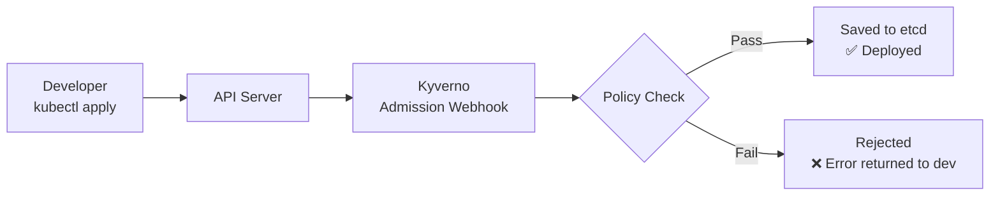

# Kyverno Policy Engine

## Why Kyverno?

When you're running workloads across teams, you can't rely on every developer to remember to set `readOnlyRootFilesystem: true` or avoid running containers as root. You need policy enforcement at the cluster level — something that catches misconfigurations before they reach production.

Kyverno sits in the Kubernetes admission flow. Every time someone applies a resource, Kyverno inspects it against your policies and either allows it, blocks it, or mutates it. No separate policy language to learn — policies are just Kubernetes YAML.

## How It Works



The webhook intercepts the request before it's persisted. The developer gets an immediate error with the reason, no guessing, no post-deployment surprises.

## Policies in This Project

| # | Policy | Category | Action |
|---|--------|----------|--------|
| 1 | `block-latest-tag` | Image Governance | Blocks `:latest` and untagged images |
| 2 | `require-resource-limits` | Operational Standards | Requires CPU/memory limits and requests |
| 3 | `block-privileged-containers` | Pod Security | Blocks `privileged: true` |
| 4 | `block-run-as-root` | Pod Security | Requires `runAsNonRoot: true` |
| 5 | `disallow-privilege-escalation` | Pod Security | Requires `allowPrivilegeEscalation: false` |
| 6 | `require-readonly-rootfs` | Pod Security | Requires `readOnlyRootFilesystem: true` |
| 7 | `restrict-host-namespaces` | Pod Security | Blocks `hostNetwork`, `hostPID`, `hostIPC` |

All policies use `validationFailureAction: Enforce` — they block, not just audit.

Excluded namespaces: `kube-system`, `kyverno`, `keda`, `monitoring` (platform-managed, exempt from app policies).

## Installation

```bash
helm repo add kyverno https://kyverno.github.io/kyverno/
helm repo update

helm install kyverno kyverno/kyverno \
  -n kyverno --create-namespace \
  -f helm/values.yaml
```

Apply all policies:
```bash
kubectl apply -f policies/image-governance/
kubectl apply -f policies/operational-standards/
kubectl apply -f policies/pod-security/
```

## Testing

Each policy folder has a `test-manifests/` directory with an unsafe pod (should be blocked) and a safe pod (should pass).

```bash
# Should be BLOCKED — violates privileged, runAsRoot, escalation, rootfs, host namespaces
kubectl apply --dry-run=server -f policies/pod-security/test-manifests/test-unsafe-pod.yaml

# Should be ALLOWED — satisfies all policies
kubectl apply --dry-run=server -f policies/pod-security/test-manifests/test-safe-pod.yaml
```

Check policy status:
```bash
kubectl get clusterpolicy
```
