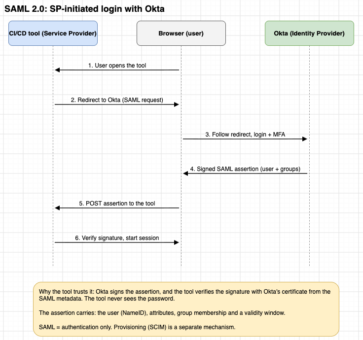
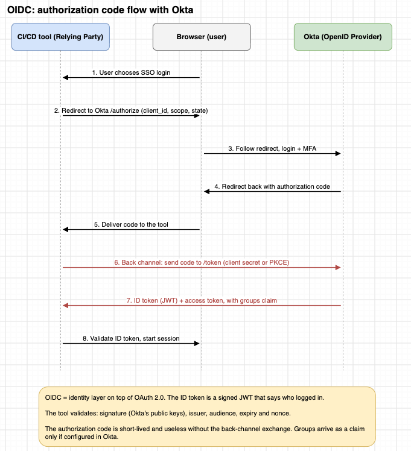

# Okta: Identity for the Delivery Platform

Notes on how enterprise identity plugs into CI/CD tooling — the protocols, what each one actually solves, and the line between human identity and machine identity. Worked example throughout: **Okta → SonarQube**.

> Reference environment: SonarQube Server 2026.1 LTA. Capabilities differ by SonarQube edition, so check your own version before copying anything here into production.

---

## The one idea that matters

Two flows reach the same tool, and they are **not** the same flow:

| | Human flow | Machine flow |
|---|---|---|
| Who | Developer in a browser | CI/CD pipeline |
| Against | SonarQube **UI** | SonarQube **API** |
| Auth | Okta SSO + MFA (SAML) | Dedicated token / service identity |
| Session | Browser session | Per-run, no session |
| Should it touch Okta? | Yes | **No** |

A pipeline should never impersonate a human's Okta session to submit an analysis. Everything below follows from that split.

---

## 1. The problem centralized identity solves

Without an identity provider, every platform tool carries its own user list:

```
GitHub ─ own users, own passwords, own offboarding
SonarQube ─ own users, own passwords, own offboarding
Grafana ─ own users, own passwords, own offboarding
Jenkins / Azure DevOps / Kubernetes / cloud consoles ─ same again
```

At 1000 developers that is 1000 × N accounts to create, MFA-enforce, audit and — the part that actually bites — **deprovision on the day someone leaves**.

With Okta in front:

```
                        Okta
             (users, groups, MFA, policies)
                          │
      ┌───────────┬───────┴───────┬───────────┐
   GitHub     SonarQube        Grafana      Cloud
```

Joiners, movers and leavers are handled in one place. MFA is enforced once, at the IdP, not re-implemented per tool.

---

## 2. SAML 2.0 — the authentication layer

SAML (Security Assertion Markup Language) is an XML-based SSO protocol with two actors:

- **IdP (Identity Provider)** = Okta. Knows who the user is, whether auth and MFA succeeded, and what groups they belong to.
- **SP (Service Provider)** = SonarQube. Deliberately does *not* want to hold the user's password — it delegates to a trusted IdP.

### SP-initiated login flow



Step by step:

1. User opens `https://sonarqube.company.com` unauthenticated.
2. SonarQube sees SAML is enabled and redirects the browser to Okta with a SAML request.
3. Okta authenticates: password, MFA, device/conditional-access policy.
4. Okta builds a **signed SAML assertion** describing the user.
5. The **browser** POSTs that assertion to SonarQube's ACS endpoint. Okta and SonarQube never talk directly — the browser is the transport.
6. SonarQube validates the signature, issuer, audience and conditions, maps attributes to a user, and starts a session.

### What's inside an assertion

Conceptually (the real XML is much larger):

```xml
<saml:Assertion>
  <Subject>medhun</Subject>
  <Attribute name="login" value="medhun"/>
  <Attribute name="email" value="medhun@company.com"/>
  <Attribute name="name"  value="Medhun Krishnamoorthy"/>
  <Attribute name="groups" value="SonarQube-Developers, Engineering"/>
</saml:Assertion>
```

### Why SonarQube trusts it

Okta signs the assertion with its private key. SonarQube holds Okta's X.509 certificate and verifies the signature, which answers two questions at once:

- Did Okta really issue this?
- Has anything been tampered with in transit through the browser?

This is cryptographic trust, not "we redirected the user somewhere and they came back." **Operational consequence:** when Okta's signing certificate rotates, the SonarQube configuration must be updated to the new certificate or every login breaks.

### Two endpoints you must get right

| Term | Meaning | SonarQube value |
|---|---|---|
| **ACS** (Assertion Consumer Service) | SP endpoint that receives the SAMLResponse | `https://<sonarqube-host>/oauth2/callback/saml` |
| **Entity ID** | Identifier for the SP — "which SAML app is this?" | Must match on both sides exactly |

The literal Entity ID string doesn't matter; the match between Okta's Audience URI and SonarQube's expected SP identifier does.

---

## 3. OIDC — the other protocol

OIDC (OpenID Connect) is an identity layer on top of OAuth 2.0. It's the modern equivalent of SAML and the one most non-legacy CI/CD tooling speaks.



The shape is similar to SAML, with one important difference: the **back channel**.

1–5. Browser redirects to Okta `/authorize`, user logs in with MFA, Okta redirects back with an **authorization code**.
6. The tool exchanges that code at Okta's `/token` endpoint **server-to-server**, using a client secret or PKCE.
7. Okta returns an **ID token** (a signed JWT) plus an access token, with a groups claim if configured.
8. The tool validates the JWT — signature against Okta's public keys, plus issuer, audience, expiry and nonce — and starts a session.

The authorization code is short-lived and worthless on its own; it only becomes a session after the back-channel exchange. That back channel is what SAML doesn't have — SAML pushes the whole signed assertion through the browser in one shot.

### SonarQube specifically: use SAML, not OIDC

SonarQube's documentation for Okta covers **SAML 2.0 only**, using SP-initiated SAML. OIDC support depends on edition and version. "SonarQube supports SAML and OIDC with Okta" is too broad a claim — for this integration, say SAML 2.0.

---

## 4. Authentication ≠ authorization

The distinction people flatten most often:

| | Question | Answered by |
|---|---|---|
| **Authentication** | Who are you? | Okta — "yes, this is Medhun, and MFA passed" |
| **Authorization** | What may you do? | SonarQube — its own permission model |

Okta does not manage SonarQube permissions. It supplies verified identity and (optionally) group membership; SonarQube decides what that identity can browse, analyze or administer.

```
Okta group                SAML groups attribute      SonarQube group       SonarQube permissions
SonarQube-Developers  ──────────────────────────▶   sonar-users       ──▶  Browse projects
SonarQube-Reviewers                                 sonar-project-admin    Execute analysis
SonarQube-Admins                                    sonar-administrators   Administer
```

With group synchronization enabled, SonarQube re-fetches group membership on each login — so removing someone from an Okta group takes effect at their next sign-in.

---

## 5. SCIM — the lifecycle layer

SCIM (System for Cross-domain Identity Management) is a **different mechanism solving a different problem**. Conflating it with SAML is the most common mistake in writing about this.

| | SAML | SCIM |
|---|---|---|
| Answers | "What happens when Medhun logs in?" | "What happens to Medhun's *account*?" |
| Triggered by | A login attempt | A change in Okta (hire, move, leave) |
| Direction | Browser carries assertion to SP | Okta pushes to the app's SCIM API |
| Operations | Authenticate, assert | Create / update / deactivate user, manage groups |

Without SCIM, a user exists in SonarQube only after their first SSO login, and deactivating them in Okta blocks future logins but leaves the account behind. With SCIM, Okta provisions and deactivates accounts directly.

```
                          OKTA
              ┌────────────┴────────────┐
           SAML 2.0                   SCIM
       (authentication)           (provisioning)
              └────────────┬────────────┘
                       SonarQube
```

**Edition caveat:** SonarQube documents SCIM as an Enterprise Edition capability, configured after Okta is set up as the SAML IdP. Don't present SSO, group sync and SCIM as if they're all universally available.

---

## 6. Configuration reference (Okta → SonarQube)

### In Okta

Create an **Application Integration → SAML 2.0** app.

| Setting | Value |
|---|---|
| Single Sign-On URL (ACS) | `https://<sonarqube-host>/oauth2/callback/saml` |
| Audience URI (SP Entity ID) | identifier SonarQube expects, e.g. `sonarqube` |
| **Sign requests** | **Disabled** |

> SonarSource states Okta does not support service-provider-signed requests, so request signing must stay off for this integration.

Attribute statements:

| Name | Okta value |
|---|---|
| `login` | `user.login` |
| `name` | `user.displayName` |
| `email` | `user.email` |

Optionally add a **group attribute statement** (`groups`) to drive SonarQube group synchronization. Assign the app to the relevant Okta users/groups.

### In SonarQube

**Administration → Configuration → General Settings → Authentication → SAML**

| SonarQube setting | Source in Okta |
|---|---|
| Application ID | Audience URI / SP Entity ID |
| Provider ID | Identity Provider Issuer |
| SAML login URL | Identity Provider Single Sign-On URL |
| Identity provider certificate | Okta X.509 certificate |
| User login attribute | `login` |
| User name attribute | `name` |
| User email attribute | `email` |
| Sign requests | Disabled |

**Pick a stable login attribute.** It is the identity key. If you map login to something mutable like email, a user changing their email can end up as a different account.

---

## 7. Where CI/CD actually fits

The pipeline authenticates to the SonarQube **API** with a machine credential, held in the CI/CD platform's secret store — never in YAML, never a developer's personal token.

```
Developer ──▶ Azure DevOps ──▶ Sonar Scanner ──▶ SonarQube API
                                                      │
                                                 Quality Gate
                                                   ┌──┴──┐
                                                 PASS   FAIL
                                                   │      │
                                                Deploy  Stop pipeline
```

```yaml
- task: SonarQubePrepare@5
  inputs:
    SonarQube: 'SonarQubeConnection'   # service connection holding the token
```

The scanner uploads metrics, vulnerabilities, code smells, coverage and duplications; the Quality Gate result then gates the deployment. Exact syntax varies by CI/CD platform.

Routing a pipeline through an interactive Okta login would be terrible for automation — it needs a human at a browser with an MFA prompt. That's why machine identity is a separate concern. In cloud-native setups the modern answer is better still: **OIDC federation and workload identity** issuing short-lived credentials, instead of long-lived static tokens.

```
Pipeline ──▶ OIDC / workload identity ──▶ cloud IAM role / K8s service account ──▶ resources
```

---

## 8. Things that trip people up

| Don't say | Say instead |
|---|---|
| "Okta gives SonarQube MFA." | "Okta enforces its authentication policies, including MFA, *before* issuing the assertion." |
| "Okta manages SonarQube permissions." | "Okta provides identity and groups; SonarQube applies its own authorization model." |
| "SonarQube supports SAML and OIDC with Okta." | "SonarQube documents SAML 2.0 for Okta; OIDC depends on edition/version." |
| "SAML, group sync and SCIM" (as one feature) | Three mechanisms: authentication, authorization input, lifecycle. |
| "Logging out of SonarQube logs you out everywhere." | Application session ≠ Okta session; SLO behavior depends on configuration. |

---

## 9. Production checklist

**Okta side**
- [ ] Conditional access, sign-on and session policies defined
- [ ] App assignment scoped to the right groups, not "everyone"
- [ ] Signing certificate rotation has an owner and a runbook
- [ ] Audience / Entity ID and ACS URL verified on both sides

**SonarQube side**
- [ ] Least-privilege project permissions; administrator access tightly held
- [ ] Group sync mapping reviewed against real Okta groups
- [ ] Login attribute is stable and immutable
- [ ] Assertion validity window and attribute mapping validated

**CI/CD side**
- [ ] Dedicated service identity — never a human's credentials
- [ ] No hard-coded tokens; secrets in the platform's secret store
- [ ] Credential rotation scheduled
- [ ] API permissions limited to what analysis actually needs

---

## 10. The interview answer

> SonarQube acts as the SAML Service Provider and Okta as the Identity Provider. When an unauthenticated user hits SonarQube, it initiates SP-initiated SAML and the browser is redirected to Okta. Okta authenticates the user — applying MFA and conditional access — and issues a signed SAML assertion. The browser POSTs that assertion to SonarQube's ACS endpoint. SonarQube validates the signature, issuer, audience and attributes, maps them to a user, and establishes a session. Group membership can travel as a SAML attribute for group synchronization, while SCIM, where the edition supports it, handles provisioning and lifecycle separately. CI/CD authentication is a distinct machine-to-machine concern and never depends on a human's Okta session.

---

## Next

Walk a real Okta → SonarQube SAML request/response and inspect the actual XML: `Issuer`, `Subject`, `NameID`, `Audience`, `Recipient`, `Conditions`, `AttributeStatement`, `Signature` — and exactly which of those SonarQube validates.

## References

- [SonarQube Server 2026.1 LTA — How to set up Okta](https://docs.sonarsource.com/sonarqube-server/2026.1/instance-administration/authentication/saml/how-to-set-up-okta)
- [SonarQube Server 2026.1 LTA — SAML overview](https://docs.sonarsource.com/sonarqube-server/2026.1/instance-administration/authentication/saml)
