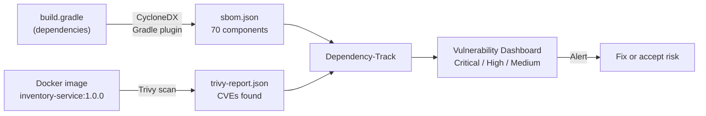

# Supply Chain Security

## Why This Matters

You can write perfectly secure application code and still ship a container full of
critical vulnerabilities — because the vulnerabilities are in your dependencies,
not your code. Log4Shell (CVE-2021-44228, CVSS 10.0) lived inside `log4j-core`, a
library used by thousands of Java applications without developers even knowing it
was there.

Supply chain security answers the question: **what exactly is inside what we ship?**

## How It Works



## What's in This Project

```
supply-chain-security/
├── sample-app/              Spring Boot inventory service (Gradle)
│   ├── build.gradle         Includes CycloneDX plugin + intentionally vulnerable deps
│   ├── Dockerfile           Single-stage, non-root, JRE-only image
│   ├── src/                 Minimal REST API (InventoryController)
│   └── sbom/
│       ├── sbom.json        SBOM generated by CycloneDX Gradle plugin
│       └── trivy-report.json  Vulnerability scan of the Docker image
└── dependency-track/
    └── helm/values.yaml     Dependency-Track deployed on kind cluster via Helm
```

## Key Concepts

**SBOM (Software Bill of Materials)** — a machine-readable list of every library,
package, and dependency in your software with exact versions. Think of it as the
ingredients label on a food product. Standards: CycloneDX (by OWASP) and SPDX (by Linux Foundation).

**CycloneDX** — the SBOM format used here. Supported natively by Dependency-Track,
Trivy, GitHub, and most enterprise security tooling. The Gradle plugin generates it
directly from your resolved dependency graph — no guessing from image layers.

**Trivy** — an all-in-one scanner by Aqua Security. Scans container images, filesystems,
Git repos, and Kubernetes clusters for CVEs. Can output in CycloneDX format so the
report feeds directly into Dependency-Track alongside the Gradle-generated SBOM.
Alternative: Grype (by Anchore) — same purpose, lighter tool, no IaC scanning.

**Dependency-Track** — an OWASP platform that ingests SBOMs and continuously monitors
them against CVE databases (NVD, GitHub Advisories, OSS Index). A CVE published
today against a library you shipped 6 months ago will trigger an alert — without
you rescanning anything.

## Tools

| Tool | Role | Where it runs |
|---|---|---|
| CycloneDX Gradle plugin | Generates SBOM from `build.gradle` dependency graph | Build time |
| Trivy | Scans Docker image for OS + app CVEs | After `docker build` |
| Dependency-Track | Ingests both reports, monitors against CVE databases | Kind cluster (Helm) |

## Running It

**1. Build the app and generate SBOM:**
```bash
./gradlew bootJar cyclonedxBom --no-daemon
# Output: build/libs/inventory-service-1.0.0.jar
#         sbom/sbom.json (70 components, CycloneDX 1.5)
```

**2. Build the Docker image and scan with Trivy:**
```bash
docker build -t inventory-service:1.0.0 .
trivy image --format cyclonedx --output sbom/trivy-report.json inventory-service:1.0.0
```

**3. Upload both reports to Dependency-Track:**
```powershell
# Encode and upload sbom.json
$sbomB64 = [Convert]::ToBase64String([IO.File]::ReadAllBytes("sbom\sbom.json"))
Invoke-RestMethod -Uri "http://localhost:8081/api/v1/bom" -Method PUT `
  -Headers @{ "X-Api-Key" = $apiKey; "Content-Type" = "application/json" } `
  -Body "{`"project`":`"$projectUuid`",`"bom`":`"$sbomB64`"}"

# Encode and upload trivy-report.json (same command, different file)
```

**4. Access the dashboard:**
```bash
kubectl port-forward svc/dependency-track-frontend 8082:8080 -n dependency-track
kubectl port-forward svc/dependency-track-api-server 8081:8080 -n dependency-track
# Open http://localhost:8082
```

## Vulnerabilities Found

The demo intentionally includes three known-vulnerable dependencies to prove the
pipeline works:

| Library | Version | Notable CVE | Severity |
|---|---|---|---|
| `log4j-core` | 2.14.0 | CVE-2021-44228 (Log4Shell) | Critical 10.0 |
| `spring-webmvc` | 5.3.0 | CVE-2022-22965 (Spring4Shell) | Critical 9.8 |
| `jackson-databind` | 2.12.0 | CVE-2020-36518 | High 7.5 |

In production the pipeline would **fail the build** at the Trivy step if any
Critical CVEs are found — before the image ever reaches the registry.
