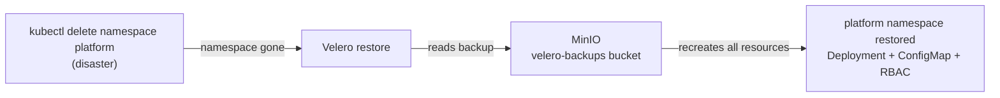

# Velero Backup & Restore

## Why This Matters

Kubernetes clusters don't protect you from yourself. A `kubectl delete namespace`
takes seconds. Recovering from it without a backup can take hours — or be impossible
if the team doesn't remember exactly what was deployed.

Velero gives you a tested restore path. Not just backups — tested restores. There's
no point having a backup you've never tried to recover from.

## How It Works



Velero snapshots every Kubernetes resource in a namespace — Deployments, ConfigMaps,
Secrets, Services, RBAC — and writes them to object storage. On restore, it
recreates all of them in order.

## What's in This Project

```
velero/
├── helm/
│   └── minio-values.yaml    MinIO deployed on kind (S3-compatible backup storage)
├── credentials-minio        AWS-format credentials Velero uses to auth with MinIO
└── README.md
```

**MinIO** acts as local S3 — no cloud account needed. Velero uses the AWS S3
plugin to talk to it since MinIO is fully S3-compatible.

## Setup

**1. Deploy MinIO (backup storage):**
```bash
helm repo add minio https://charts.min.io/
helm install minio minio/minio \
  -n minio --create-namespace \
  -f helm/minio-values.yaml
```

**2. Install Velero (pointing at MinIO):**
```bash
velero install \
  --provider aws \
  --plugins velero/velero-plugin-for-aws:v1.12.1 \
  --bucket velero-backups \
  --secret-file credentials-minio \
  --use-volume-snapshots=false \
  --backup-location-config region=minio,s3ForcePathStyle=true,s3Url=http://minio.minio.svc.cluster.local:9000 \
  --namespace velero
```

**3. Verify Velero can reach MinIO:**
```bash
velero backup-location get
# PHASE should be: Available
```

## Backup & Restore Demo

**Deploy a sample app:**
```bash
kubectl create namespace platform
kubectl create configmap app-config -n platform \
  --from-literal=env=production --from-literal=version=1.0.0
kubectl apply -f sample-app.yaml   # Deployment with compliant securityContext
```

**Take a backup:**
```bash
velero backup create platform-backup-v1 --include-namespaces platform --wait
velero backup get
# STATUS: Completed
```

**Simulate disaster:**
```bash
kubectl delete namespace platform
kubectl get namespace platform
# Error from server (NotFound) — it's gone
```

**Restore:**
```bash
velero restore create --from-backup platform-backup-v1 --wait
kubectl get all -n platform
# webapp pods Running, configmap restored
```

The restore recreated 26 resources — Deployment, ReplicaSet, Pods, ConfigMap,
ServiceAccount, RBAC bindings — all from the backup in MinIO.

## Scheduled Backups

For production, run backups on a schedule and set a retention TTL:

```bash
# Backup every 6 hours, keep backups for 72 hours
velero schedule create platform-schedule \
  --schedule="0 */6 * * *" \
  --include-namespaces platform \
  --ttl 72h

velero schedule get
```

Velero will automatically delete backups older than the TTL — no manual cleanup needed.

## Notes

- **`PartiallyFailed` on restore describe** — this is a known CLI limitation when
  running outside the cluster. The CLI can't resolve `minio.minio.svc.cluster.local`
  from your laptop. Check `kubectl get all -n platform` instead — if resources are
  there, the restore succeeded.

- **MinIO persistence** — deployed without a PV in this demo (`persistence.enabled: false`).
  Backups live in pod memory and are lost on pod restart. In production, back MinIO
  with a real PV or use cloud object storage (S3, Azure Blob, GCS).

- **Volume snapshots** — disabled (`--use-volume-snapshots=false`). Velero can
  snapshot PersistentVolumes using CSI snapshots, but that requires cloud provider
  support. For kind, we back up resource definitions only.
